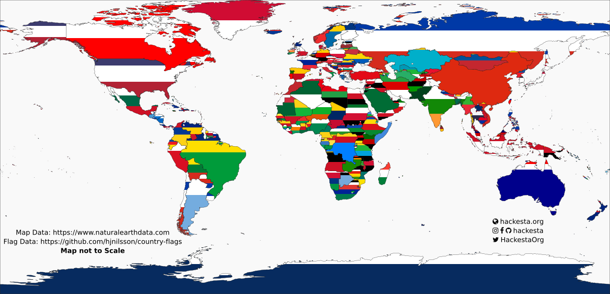

# COUNTRY FLAG VISUALIZATION
Visualising the ratio of flag colors on a map

[Inspired by this reddit post](https://www.reddit.com/r/dataisbeautiful/comments/c7lpmw/frequency_of_flag_colors_by_continent_imaginary/)

Map Source: [https://naturalearthdata.com/downloads/](https://naturalearthdata.com/downloads/)  
Flags: [https://github.com/hjnilsson/country-flags](https://github.com/hjnilsson/country-flags)

